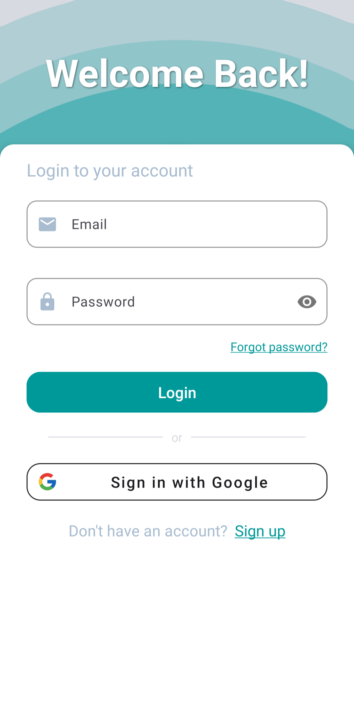
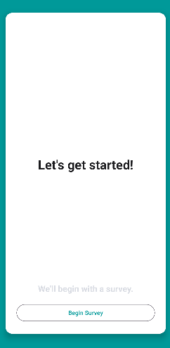
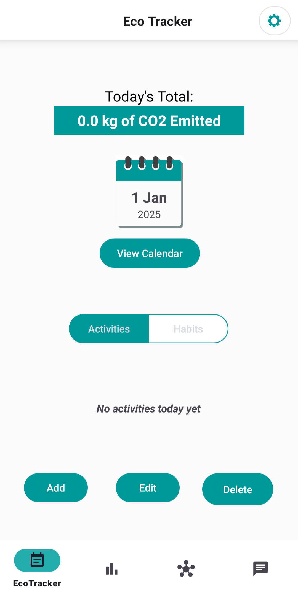
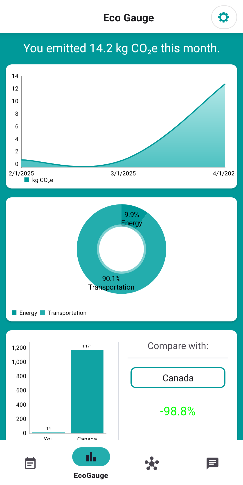
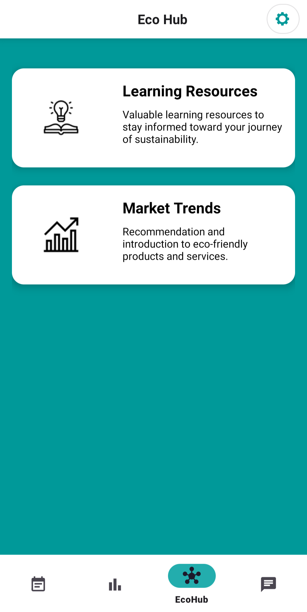
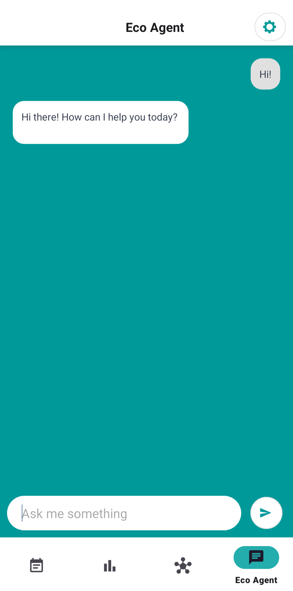

# ZeroCarbon

Enhanced Carbon Emissions Tracker based on [Planetze Carbon Emissions Tracker](https://github.com/A-Skvortsov/Planetze).

## Original Authors

- Ahmad
- Minki
- Adeeb
- Nethanel
- Andrey

## Links

Original repository: https://github.com/A-Skvortsov/Planetze

## Features

**Sign-In/Sign-Up**

Sign-in and sign-up for an account using your name, email, and password, or using a Google account. Additionally, if the user doesn't remember their password, they have the option to reset it. Using the 'Forgot password' link.

 
 
**Initialization Survey**

Survey for new users to view their initial carbon impact. Users can redo this survey at any time for the Eco Tracker.

 

**Eco Tracker**

View and manage their daily emissions, habits, and activity logs using a calendar.

 

**Eco Gauge**

Displays the user's emissions trends and breakdowns and comparisons to global/national averages along various time periods.

 

**Eco Hub**

Offers educational resources, such as videos on reducing carbon emissions, and access to recommended products, services, and websites related to emissions and carbon footprint reduction.

 

**Eco Agent**

Features a chatbot that assists users by answering questions about the app and providing tips for reducing carbon emissions.

 

**Settings**

Allows users to customize the app's functionality and manage their account.

## Acknowledgements
	
- Original Contributors

-  [MPAndroidChart](https://github.com/PhilJay/MPAndroidChart), for Eco Gauge charts
  
-  [OpenCSV](https://opencsv.sourceforge.net/), a csv parser, for parsing through country emission data. 

- [MaterialCalendarView](https://github.com/prolificinteractive/material-calendarview), an extension of the built-in CalendarView library, for the Eco Tracker calendar.
  
- [YouTubePlayer](https://github.com/PierfrancescoSoffritti/android-youtube-player), for Eco Hub learning resources videos

- [Material Design](https://material.io/design), for the UI/UX design elements

